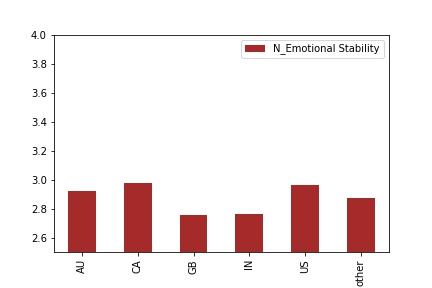

# bigfive
Exploring [a Big 5 dataset publicly available](https://openpsychometrics.org/_rawdata/), and check if we can train a model to discern certain features. 
Data preprecessing and exploration in big5.ipynb. Model training and selection in big5_pred.ipynb. (Some Norwegian comments and variable names, probably)

### Data exploration
We find that there are some interesting changes in how peole score themselves,young vs old. Also the average scoring varies a bit between countries.





## Models
### Age
I used the 50 anwers as X. None of the ohter data.
Tried out the scikit-learn pipeline. Result (Avg years error in prediction):
```
LM_Ridge : Modellen estmierer i snitt 6.3 år feil i alder. Parametre: {'model__alpha': 0.01, 'model__tol': 0.9}
ElasticNet : Modellen estmierer i snitt 6.4 år feil i alder. Parametre: {'model__alpha': 0.5, 'model__l1_ratio': 0.2}
BayesianRidge : Modellen estmierer i snitt 6.3 år feil i alder. Parametre: {'model__alpha_1': 1e-05, 'model__alpha_2': 1e-07, 'model__lambda_1': 1e-07}
KernelRidge : Modellen estmierer i snitt 25.3 år feil i alder. Parametre: {'model__alpha': 0.1}
GradientBoostingRegressor : Modellen estmierer i snitt 5.9 år feil i alder. Parametre: {'model__loss': 'lad', 'model__max_depth': 5}
LinearSVR : Modellen estmierer i snitt 6.0 år feil i alder. Parametre: {'model__C': 1.0, 'model__epsilon': 0.0, 'model__tol': 0.0001}
SVR : Modellen estmierer i snitt 5.8 år feil i alder. Parametre: {'model__C': 5, 'model__kernel': 'rbf'}
```
In [big5_reg_kategoriske_x](https://github.com/egilron/bigfive/blob/main/big5_reg_kategoriske_x.ipynb) I explore more scikit-learn preprocessing, and adding categorical data to X.
